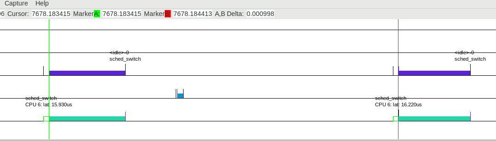
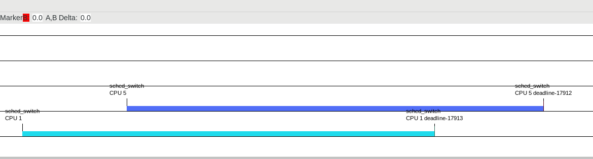

# RT Examples #

## About ##

These example programs show howto implement user space realtime applications
with Linux.

## Build ##

    $ mkdir build
    $ cd build
    $ cmake ..
    $ make -j8

## Tracing ##

In order to make sure that the examples actually work, the Linux tracing
infrastructure can be utilized.

### Cyclic ###

    $ sudo trace-cmd record -e 'sched:sched_switch' -e 'sched:sched_wakeup' ./cyclic
    $ kernelshark

### Deadline ###

    $ sudo trace-cmd record -e 'sched:sched_switch' -e 'sched:sched_wakeup' ./deadline
    $ kernelshark

### Signal ###

Signal measures the latency between a cyclic task wants to wake up and is
actually woken up. It signals the maximum latency to a printing thread using
pthread condition variables.

### LTTng ###

This example demonstrates howto utilize LTTng for user space tracing. Take
trace:

    $ ./cyclic_lttng &
    $ lttng-sessiond --daemonize
    $ lttng create my-session
    $ lttng enable-event --userspace cyclic:cyclic_tp
    $ lttng start
    $ sleep 5
    $ lttng stop
    $ lttng destroy
    $ babeltrace ~/lttng-traces/my-session-*

### USDT ###

This example shows howto utilize BPF in order to trace user static defined
trace probes:

    $ ./cyclic_usdt &
    $ ./trace.py <pid_of_cyclic_usdt>

### ETF ###

This example shows how to implement a Time Sensitive Networking (TSN) talker and
listener using UDP or RAW Ethernet based communication.

## Dependencies ##

- Linux version >= 3.14 for deadline scheduling
- Linux version >= 4.7 for tracepoint probes
- Recent Linux version for XDP
- LTTng: optional
- BCC: optional
- Systemtap-sdt: optional
- LLVM/Clang: optional
- libbpf: optional

## Author ##

Copyright (C) 2018-2021 Kurt Kanzenbach <kurt@kmk-computers.de>

## License ##

GPL Version 2
